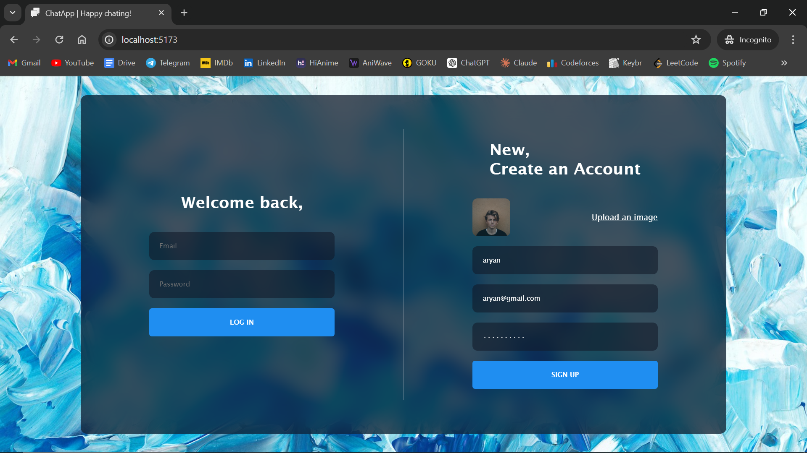

# Realtime Chat Application

A realtime chat application enabling seamless communication. Developed with React.js, Zustand, timeago.js, emoji-picker-react, react-toastify, and Firebase.

## Features

- **User Authentication**: Register and securely log in using Firebase authentication.
- **Realtime Communication**: Engage in chat with other users in real time.
- **Media Sharing**: Share text messages, images, and emojis instantly.
- **User Management**: Block other users so that they can't send you messages.
- **User Search**: Easily search and find other users to start a conversation.

## Technologies Used

- React.js
- Firebase
- Zustand
- timeago.js
- emoji-picker-react
- react-toastify

## Screenshots

- Realtime Chat

- Search

- Registration Page

- Block Feature

## Usage

1. Register as a new user or log in.
2. Utilize the user search feature to find other users.
3. Start chatting with other users in realtime.
4. Utilize the provided features for sending text messages, images, and emojis.
5. Manage users by blocking/unblocking as needed.

## Happy Chating!
