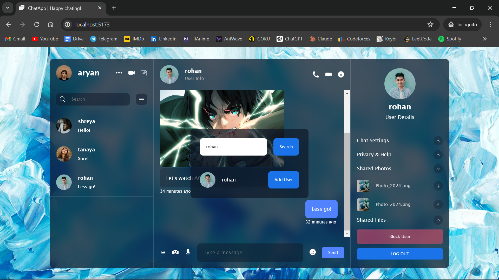
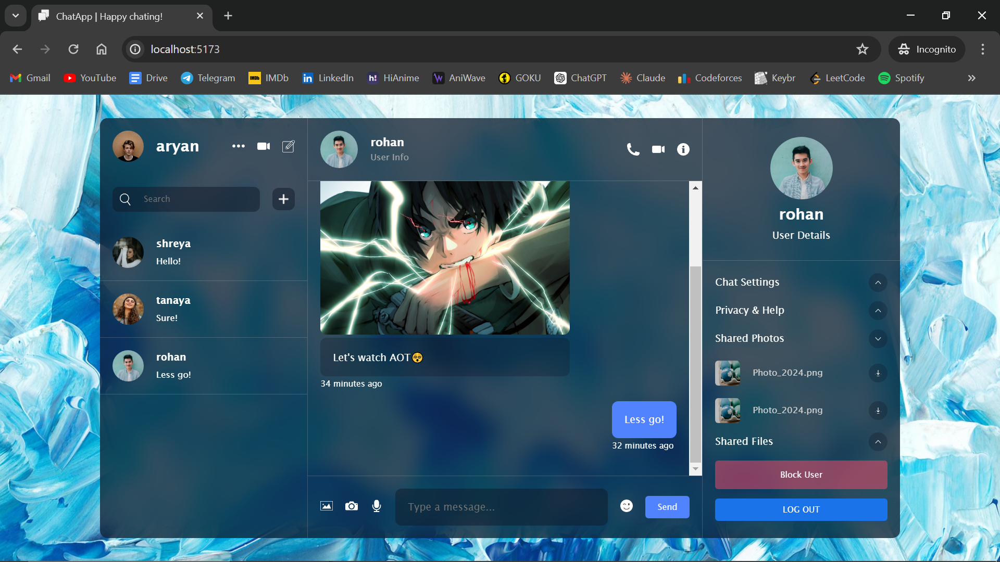

# Realtime Chat Application

A realtime chat application featuring an AI chatbot integration for seamless communication. Developed with React.js, Zustand, timeago.js, emoji-picker-react, react-toastify, Firebase, and the Gemini API.

## Features

- **User Authentication**: Register and securely log in using Firebase authentication.
- **Realtime Communication**: Engage in chat with other users in real time.
- **Media Sharing**: Share text messages, images, and emojis instantly.
- **User Management**: Block other users so that they can't send you messages.
- **User Search**: Easily search and find other users to start a conversation.
- **AI ChatBot**: Interact with a chatbot powered by the Gemini API.

## Technologies Used

- React.js
- Firebase
- Zustand
- timeago.js
- emoji-picker-react
- react-toastify
- Gemini API

## Screenshots

- Registration Page

- Search

- Realtime Chat

- AI ChatBot

- Block Feature

## Usage

1. Clone the repository.
2. Create .env file in local desktop with the help API keys for Firebase and Gemini. (Also add the user ID of AI User in .env file)
3. Register as a new user or log in (if already registered).
4. Utilize the user search feature to find other users or AI ChatBot.
5. Start chating with other users in realtime.
6. Users can send text messages, images, and emojis.
7. Interact with the AI chatbot by starting a conversation with the AI ChatBot.
8. Manage users by blocking/unblocking as needed.

## Firebase

The application utilizes Firebase for authentication, real-time database and real-time stoarage. To set up Firebase:

- Get your Firebase API key and other configuration details.
- Store the Firebase configuration in the (.env) file.

## AI Chatbot Integration

The application includes an AI chatbot powered by the Gemini API. To interact with the chatbot:

- Get your Gemini API key and create AI User ID and store both in (.env) file.
- Search and start a conversation with the AI ChatBot.
- Send prompts to the ChatBot and receive AI generated responses.

## Happy Chating!
